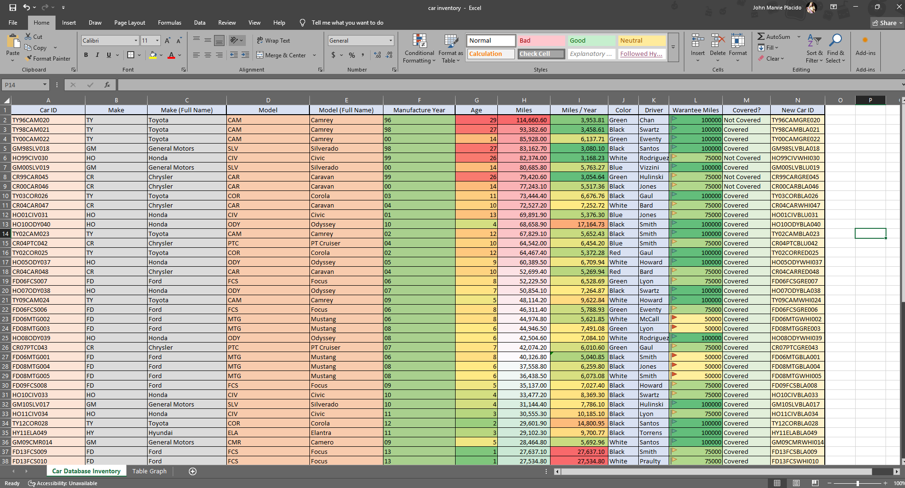
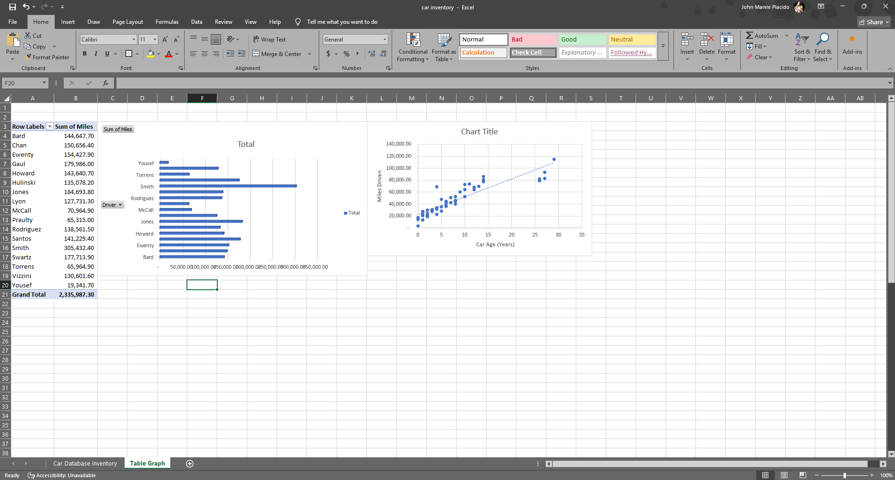

# Car Inventory Database  

This project focuses on **data cleaning, transformation, and analysis** of a pre-determined car inventory dataset. The raw data contained inconsistencies in formats, naming conventions, and structure. My task was to clean and restructure the dataset into a well-organized system while applying real-world business rules.  

## Project Overview  
- Cleaned messy raw data (inconsistent car models, warranty details, and date formats).  
- Created calculated fields for **Age**, **Miles/Year**, and **Warranty Coverage**.  
- Standardized car IDs by concatenating multiple attributes for unique identification.  
- Built a **Pivot Table** to summarize mileage by driver and highlight performance trends.  
- Applied **IF logic** to automatically classify vehicles as “Covered” or “Not Covered.”  

## 🛠Skills Demonstrated  
- **Excel Data Cleaning**: Standardizing inconsistent entries and formatting.  
- **Data Transformation**: Creating new calculated fields for meaningful insights.  
- **Business Logic Application**: Translating warranty/mileage rules into formulas.  
- **Pivot Tables & Summarization**: Aggregating raw data into clear, actionable insights.  
- **Analytical Thinking**: Converting messy data into a reliable decision-making tool.  

## Project Snapshots  
Here are two views from the project:  

## Raw & Cleaned Data  
  

### Summary Insights (Pivot Table)  
  
